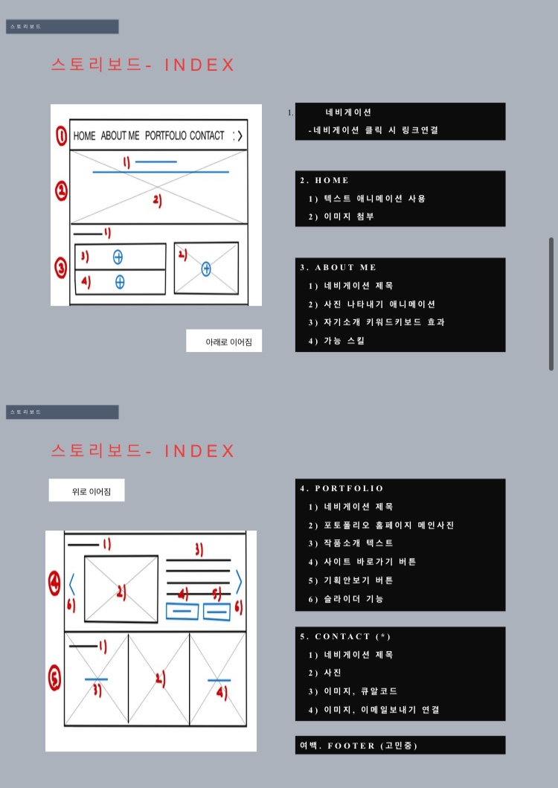

# 박유진의 포트폴리오에 오신것을 환영합니다.

## 보유자격 및 경력
* 운전면허 2종 보통
* 정보처리기사

## 사용가능기술
* HTML5, CSS3, JQuery, 스프링게시판 구현
* PothoShop, Illustrator, Premiere Pro, After Effect

## WORK FLOW
### 와이어프레임

### 스토리보드

### 무드보드

### 키워드

## PORTFOLIO
[개인포트폴리오](https://rtt1006-portfolio.github.io/Project-2/)  

[메가박스](https://rtt1006-portfolio.github.io/Megabox/)  

[한솔](https://rtt1006-portfolio.github.io/Hansole/)  

[할리스](https://github.com/rtt1006-portfolio/Hollys)  

[인디고](https://rtt1006-portfolio.github.io/Indigo/)  

[투어리스트](https://rtt1006-portfolio.github.io/Tourist/)
