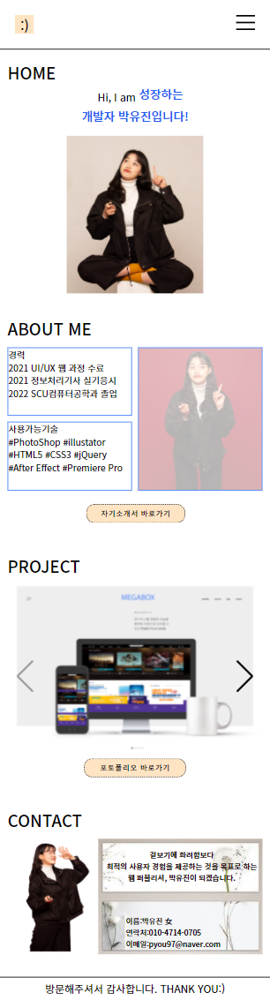
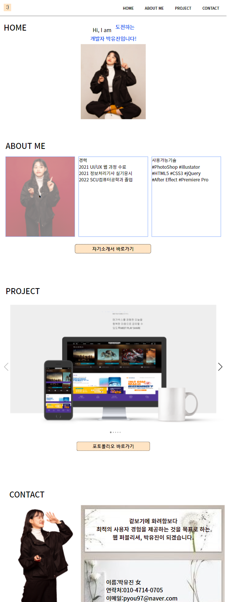
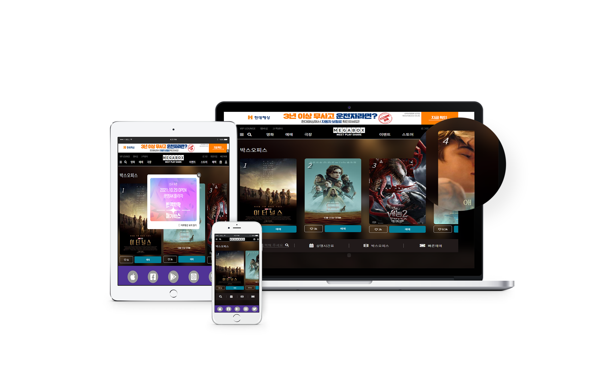
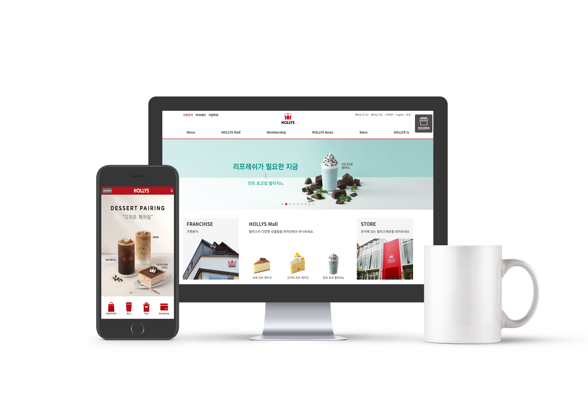
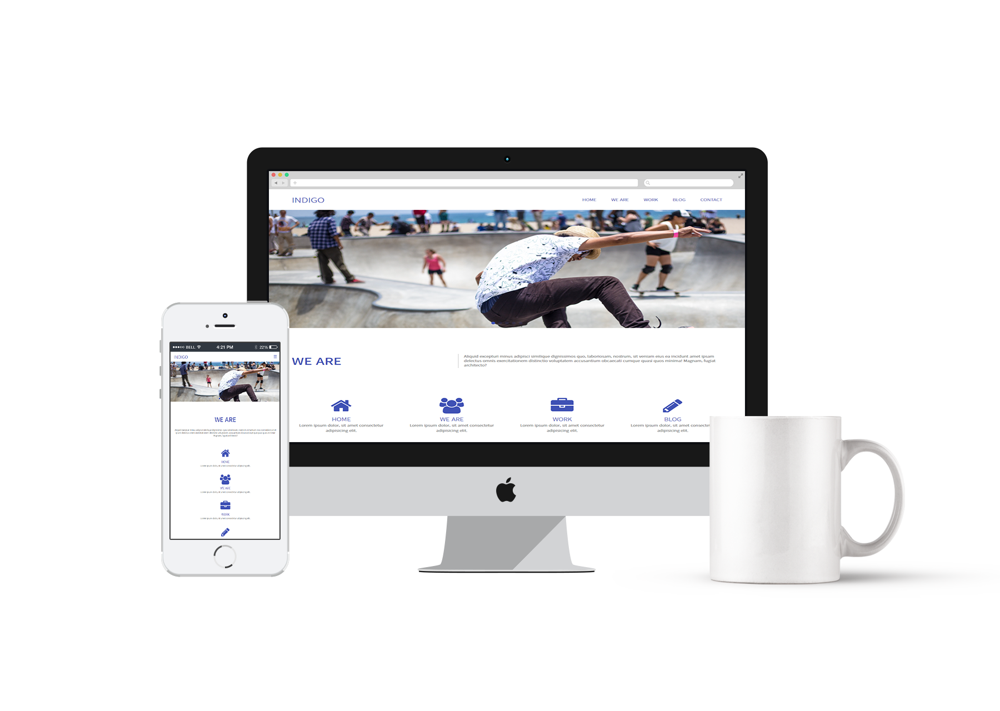
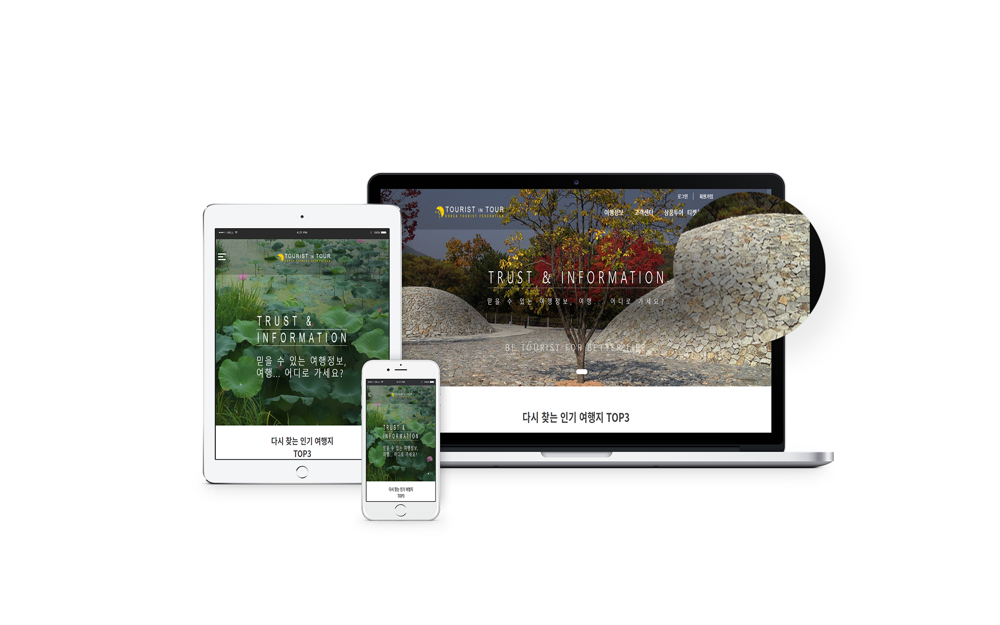

# 박유진의 포트폴리오에 오신것을 환영합니다.

## 보유자격 및 경력
* 운전면허 2종 보통
* 정보처리기사

## 사용가능기술
* HTML5, CSS3, JQuery, 스프링게시판 구현
* PothoShop, Illustrator, Premiere Pro, After Effect

## WORK FLOW
### 와이어프레임

https://user-images.githubusercontent.com/93187201/143181775-80f4ad6b-3c27-4387-851a-14f43890616d.mp4

https://user-images.githubusercontent.com/93187201/143181788-9e89ba25-17a6-461d-a40d-710547a2c78a.mp4

### 스토리보드

### 무드보드

### 키워드

## PORTFOLIO
[개인포트폴리오 디자인](https://rtt1006-portfolio.github.io/Project-2/)  
### 모바일시안

### 데스크탑시안

*

[메가박스](https://rtt1006-portfolio.github.io/Megabox/)  

[한솔](https://rtt1006-portfolio.github.io/Hansole/)  

[할리스](https://github.com/rtt1006-portfolio/Hollys)  

[인디고](https://rtt1006-portfolio.github.io/Indigo/)  

[투어리스트](https://rtt1006-portfolio.github.io/Tourist/)

